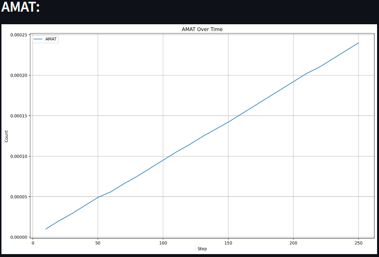
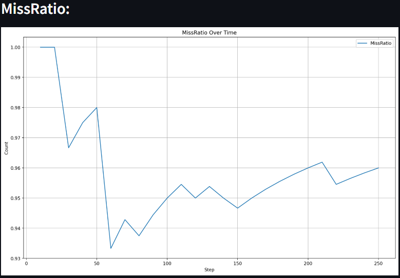

# Thread-safe K-Way Set Associative Cache Simulation

A C++ based K-Way Set Associative Cache Simulaton meant to simulate the behavior of a k-way set associative cache in a single/multi-threaded environment. It supports graphical visualizations of metrics like `Average Memory Access Time (AMAT)`,` miss ratio`, `miss count`, and `hit count`. There are a fair number of helper functions. The size of the cache is customizable and performance metrics can be seen using the graphs (or terminal output). It supports two execution methods—sequential and random— which enables to gather data points (stored as csv files) for comparision. The project is wrapped in a Python Streamlit interface for ease of use, providing a straight-forward and interactive way to visualize and understand cache performance under different configurations.

To ensure the reliability of the cache simulation, I integrated the gtest library to create a small series of unit tests. These test cases were designed to validate the core functionality of the cache, including correct handling of cache hits, misses, and accurate calculation of performance metrics like miss ratio and AMAT, and additionally checking for edge case scenarios.

### Dependencies
```
C++ 17
Make 4.3
gtest

Python 3.10.12
streamlit 1.36.0
pandas 2.2.2
matplotlib 3.9.0
```
*version number is version used when building*

To install gtest, run:

```console
sudo apt-get install -y libgtest-dev cmake
mkdir -p $HOME/build
cd $HOME/build
sudo cmake /usr/src/googletest/googletest
sudo make
sudo cp lib/libgtest* /usr/lib/
cd ..
sudo rm -rf build
sudo mkdir /usr/local/lib/googletest
sudo ln -s /usr/lib/libgtest.a /usr/local/lib/googletest/libgtest.a
sudo ln -s /usr/lib/libgtest_main.a /usr/local/lib/googletest/libgtest_main.a
```
*found from [here](https://gist.github.com/Cartexius/4c437c084d6e388288201aadf9c8cdd5)*

### Quick Start
To run the main visualization, make sure all the dependencies are installed and simply run:
`streamlit run HOME.py` (this automatically creates the object file)

To run tests:
```
make
./test
```
or 
```
g++ test.cpp -g -lgtest -lgtest_main -pthread -o test
./test
```

Select execution method and graph visualisations

### Exapmle Output



```
TERMINAL OUTPUT:
Current size of cache (bytes) :16
Number of lines in each Set :4
Number of sets: 4
Cache Miss Count: 240
Cache Hit Count: 10
Cache Miss Ratio: 0.96
AVERAGE MEMORY ACCESS TIME: 0.0002401seconds
```
>>>>>>> ff222d8 (Added README + some file changes)
